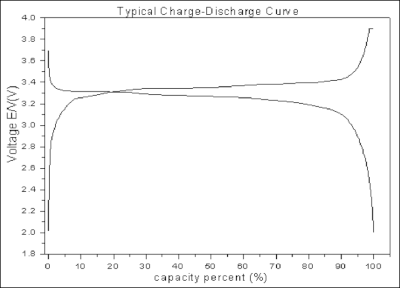

# Theroretical intro and Getting Startded

- [Theroretical intro and Getting Startded](#theroretical-intro-and-getting-startded)
- [LiFePo Cells Basics](#lifepo-cells-basics)
  - [Capacity (C)](#capacity-c)
- [Determination of the SoC](#determination-of-the-soc)

This abstract deals with the basics around

- Batteries
- Threshold and limit values
- Battery Management Systems (BMS)
- Inverter
- Balancer

There are a lot of settings to be made in order to operate a battery cell as well as possible in its voltage comfort zone and to give it the longest possible life.

This documentation is intended to explain central relationships. The explanations are kept short, if possible, in order not to confuse newcomers unnecessarily. The values are often only example values, which everyone has to adapt sensibly - depending on own hardware setup.

# LiFePo Cells Basics

In order not to damage a battery cell of the type LiFePo4 (LFP), it should be operated within the defined specification range of the manufacturer. For our 50Ah EVE K-cells this is - as for most other manufacturers and models - min. 2.5V and max. 3.65V. Please check the [product specification](./LF50K3.2V-50Ah-Product-SpecificationVersion-D.pdf) beforehand.

> <span style="color:red"> **Always operate your cells in the absolute limit range of 2.5 and 3.65V!**</span>

To maximize the number of cycles of the cells, one should however avoid the maximum marginal ranges downwards and upwards. In particular, one should avoid that a cell remains at this level for days after charging to 3.65V.

> <span style="color:red">The comfortable range of a LFP cell is about 3.1V (~5% SoC) to 3.4V (~95% SoC)!</span>

This is a voltage delta of only about ~0.3V. If one moves in this range, almost the maximum possible capacity can be used.

LFP cells have a characteristic voltage behavior based on their cell chemistry and an associated very narrow voltage range. While the cell voltage is almost stable in the middle ~80% State of Charge (SoC) range, it "drops" very quickly towards the edges.



On the one hand, this is very useful as the voltage does not drop significantly even with a low SoC. But on the other hand, it is also more difficult to catch a cell leaving the average range of the bulk. Furthermore, it is almost impossible to determine the SoC of a cell based on its voltage due to the relatively constant voltage in the medium operating range.

## Capacity (C)

A look at the capacity: When capacity (C) is mentioned, this means:

Operating a cell having 50Ah, it means that 50A can be drawn or charged for one hour.

```bash
Push/pull 50A into/out of the cell for 1 hour to reach 100% SoC
50Ah => 1C/1C => 100%
```

When the cell is operated at half capacity (charging, discharging) we speak of 0.5C/0.5C

```bash
Push/pull 25A into/out of the cell for 2 hours to reach 100% SoC
50Ah => 0.5C/0.5C => 100%
```

Maximum current of charge/discharge according to the data sheet are

- Constant charge/discharge: 3C/3C (pushing 150A into the battery for an hour)
- Pulse charge/discharge **(30s)**: 5C/5C (pushing 250A into the battery)

When charging mith different C values the cell voltage behaves also different:


# Determination of the SoC

During charging, the cell voltage can increase abruptly depending on the SoC. This may be the case if you are chaging with high power (>0.3c).

On the other hand, when discharging, the voltage can collapse by 0.1V or more at higher load. With a targeted operational voltage range of less than 0.5V (comfort zone), this is an immense increase/decrease!

> BMS uses the voltage only as an initial indicator, it calculates the SoC during operation based on the upper and lower limits

The limits "full" and "empty" are to be configured individually based on the data sheet, for example

- 100% SoC (fully charged) corresponds to 3.4V..3.5V
- 0% SoC (fully discharged) corresponds to 3V

> Caution: The operation of the battery in these extreme limits must be well considered, this affects the service life!

After initial calibration, the power flowing into the cell over time (the work W) and correspondingly being removed during discharging is measured continuously. Knowing the battery capacity (in ampere-hours, Ah), the shunt (integrated in the BMS or as separate hardware) then calculates the current SoC.
