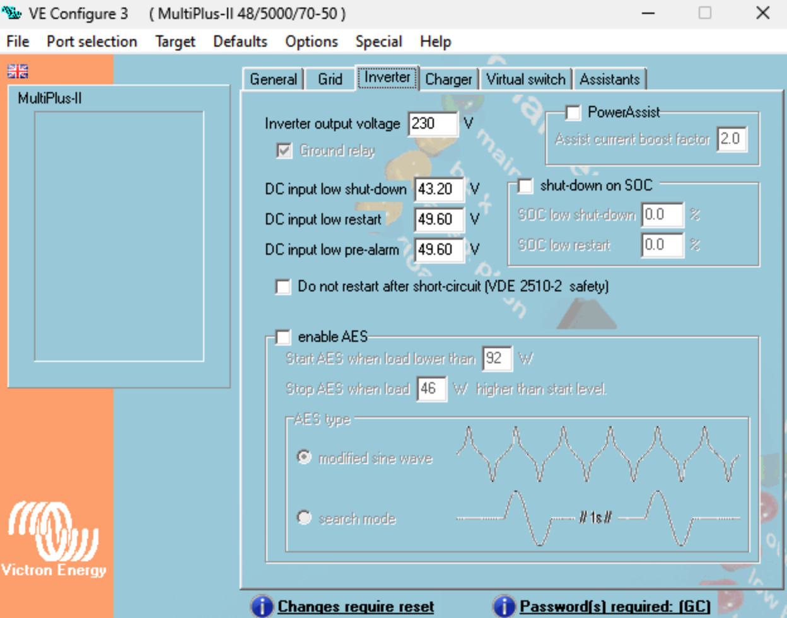

# Multiplus configuration (Array)

- [Multiplus configuration (Array)](#multiplus-configuration-array)
- [General configuration and background](#general-configuration-and-background)
  - [Base parameters](#base-parameters)
  - [Inverter settings](#inverter-settings)
    - [DC input low shut down](#dc-input-low-shut-down)
    - [DC input low restart](#dc-input-low-restart)
    - [DC input low pre-alarm](#dc-input-low-pre-alarm)
    - [Shutdown on SoC](#shutdown-on-soc)
  - [Additional information](#additional-information)

# General configuration and background

## Base parameters

We're running EVE LF50K cells ([datasheet](../basics/LF50K3.2V-50Ah-Product-SpecificationVersion-D.pdf)) which operate best in voltage range 3.0V .. 3.4 V. With 16 cells

## Inverter settings

Pls find below some inverter settings and a brief description what and why to set them.

Beware: The settings show here are Best-Practice values and may vary in your installation, depending on your hardware setup.

### DC input low shut down

Backup values for Multiplus (fetched if leading BMS does not operate for any case) are set in the multiplos configuration. Range for absolute minimum cell voltage is 3.1V (going deeper will destroy your batteries)

So our low shut down value is 2.7V x 16 = 43.2V.

### DC input low restart

After reaching the DC imput low shutdown limit the battery pack may not start over until some more energy was pushed into the single battery cells. Starting the battery cells savely may be done when the battery has reached the **DC input low restart value**.

So our low restart value is 3.1V x 16 = 49.6V.

### DC input low pre-alarm

Displaying critical ranges as an alarm may be specified in the low pre alarm. This may be set slight above the low restart value, depending on your needs. Setting this value has no effect expect for sending you an alarm notification.

### Shutdown on SoC

You may *additionally* also operate your battery ranges based on the SoC. Set percental values here if you think you need that.

## Additional information

Pls find below links to valuable videos

|Author|Description & Content|link|
|---|---|---|
| Panda Solar | General Victron Setup | [link](https://www.youtube.com/watch?v=-6A0ThokpiM)|