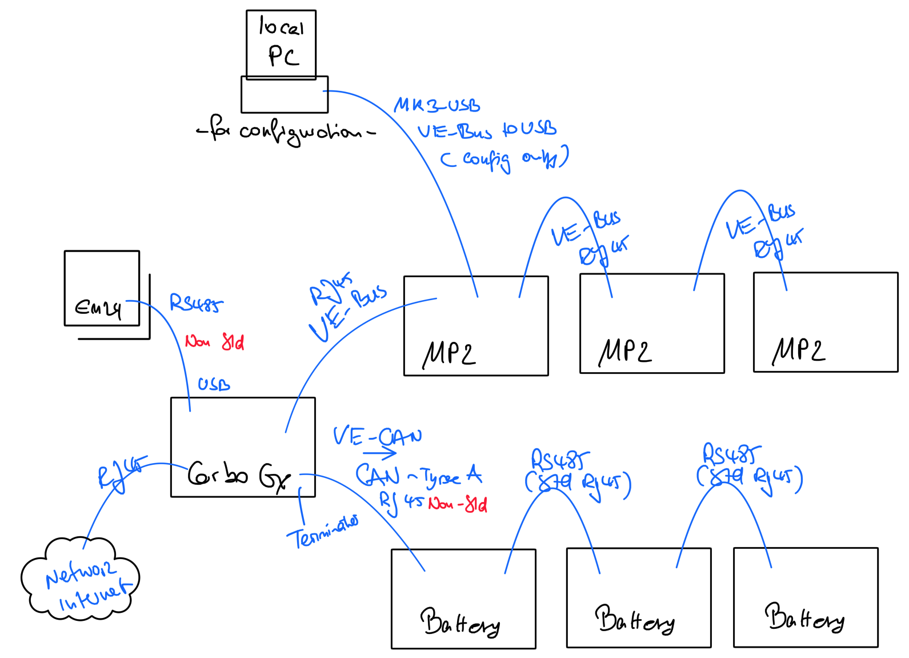
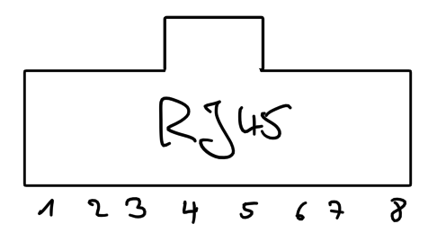

- [Controlling cable](#controlling-cable)
  - [Connecting EM24 to Cerbo GX](#connecting-em24-to-cerbo-gx)
  - [Connecting Multiplus to Cerbo GX](#connecting-multiplus-to-cerbo-gx)
  - [Connecting Multiplus Array](#connecting-multiplus-array)
  - [Connecting Multiplus to your PC (Configuration)](#connecting-multiplus-to-your-pc-configuration)
  - [Connecting Battery (Seplos) to Cerbo GX](#connecting-battery-seplos-to-cerbo-gx)
  - [Connecting Battery (Seplos) to the Battery Monitor (Seplos) on your PC (Configuration)](#connecting-battery-seplos-to-the-battery-monitor-seplos-on-your-pc-configuration)
  - [Connecting Battery Array](#connecting-battery-array)

# Controlling cable

There are various cables in the system to secure the data flow between the instances. 

Pls find below an overview 

## Connecting EM24 to Cerbo GX

To connect an EM24 to a Cerbo GX you need a RS485 cable like sold [here](https://www.amazon.de/Victron-Energy-Interface-ASS030572018-Adapter-Kabel/dp/B09NRBLW96/). 

Connection type: 
1. Cerbo GX: USB 
2. EM24: single cables

The RS485 to USB interface cable between the GX device and the Energy Meter can be extended up to 100 meters; make sure that the extensions of the Data+ (orange) and Data- (yellow) wires form a twisted pair.

The table below shows the colors of the wires and their connection to the terminals of the EM24 RS485, as well as the colors to be used for a CAT5 extension cable.

|RS485 to USB|RS485 Signal|EM24 RS485 terminal number|Suggested wire color CAT5 extension cable|
|---|---|---|---|
|Orange|Data +|42|Orange|
|Yellow|Data -|41|Orange/White|
|Black|GND|43|Brown|

The red, green and brown wire coming out of the RS485 to USB cable are not used. Cut them off or bend them back and isolate them.

Pls find further details on the [victron homepage](https://www.victronenergy.com/media/pg/Energy_Meter_EM24_RS485/en/installation-and-configuration.html#UUID-842df419-d17e-0830-4845-5c17d719ff1f)

## Connecting Multiplus to Cerbo GX

To connect a Multiplus to a Cerbo GX pls use a **standard RJ45 cable** using the **VE-BUS plugs**

Connection type: 
1. Cerbo GX: RJ45
2. Multiplus: RJ45

## Connecting Multiplus Array

To connect a Multiplus Array pls use a standard RJ45 cable using the **VE-BUS plugs**

Connection type: 
1. Multiplus outgoing: RJ45
2. Multiplus incoming: RJ45

## Connecting Multiplus to your PC (Configuration)

To connect a Multiplus (Array) to your PC a CAN bus connection is used. This is a **Non-Standard RJ45 cable**. This can be 

* purchased directly from Victron [here](https://greenakku.de/Zubehoer/Systemueberwachung/Interfaces/VE-Can-zu-CAN-bus-BMS-Typ-B-Kabel-5m::3676.html)
* crimped on your own.

Connection type: 
1. Multiplus outgoing: RJ45
2. Multiplus incoming: RJ45

To build this cable on your own pls proceed like described below: 

|Function|Victron (Plug: CE.Can)|Battery (Plug: CAN)|
|---|---|---|
|GND|Pin 5|Pin 6|
|CAN-L|Pin 8|Pin 5|
|CAN-H|Pin 7|Pin 4|

Beware: Do not accidentally mix up the sides, this will not work!

## Connecting Battery (Seplos) to Cerbo GX

## Connecting Battery (Seplos) to the Battery Monitor (Seplos) on your PC (Configuration)

## Connecting Battery Array

To connect a Battery Array pls use a standard RJ45 cable using the **RJ45 plugs**

Connection type: 
1. Battery outgoing: RJ45
2. Battery incoming: RJ45

Note: choose any of the available RJ45 connections.

**Important:** It is not possible to connect a Battery Monitor **AND** a CAN bus (to a Cerbo device) in parallel, if you want to use the Battery Monitor pls disconnect the CAN bus before, otherwise it will not work...
